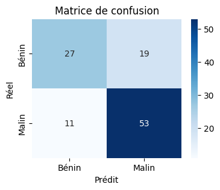

# Breast Cancer Detection with Machine Learning 

A Streamlit app that combines **tabular data** (LightGBM + SHAP explanations) and **biopsy images** (ResNet18 + saliency maps) to predict whether a breast tumor is benign or malignant .
Features
[](https://breastcancerdetection-gz8mcy2xxs5xsqk55mas9t.streamlit.app/)
 ## Multimodal prediction

ResNet18 on biopsy images

LightGBM on tabular tumor measurements

## Interactive UI

Sliders for 30 numeric features

File uploader for biopsy image

## Explanations

Waterfall SHAP for tabular features

Gradient saliency map over the image

A permanent “How to interpret” sidebar


---
## Project Structure
- **data/**:  contains 10 images to test in the Streamlit app.  
- **notebooks/**: exploratory analysis and training notebooks  
- **src/**: reusable Python modules (preprocessing, training, evaluation, explanation)  
- **app/**: interactive Streamlit application  

## Installation

```bash
git clone https://github.com/saratouahri/Breast_Cancer_Detection.git
cd Breast_Cancer_Detection.git
pip install -r requirements.txt
```
## Dataset Sizes

 **Tabular data (Wisconsin Breast Cancer Dataset from scikit-learn):**

569 samples, 30 numeric features

 **Image data (MedMNIST BreastMNIST):** 

780 grayscale images (28×28), resized to 224×224

Train / Val / Test split: 546 / 78 / 156 images

 **Multimodal dataset:** 

546 paired samples (image + 30-dim feature vector + label)

## Run the Streamlit app
```
streamlit run app/app.py


```
## Key Results
**Confusion Matrix**




**Metrics**

Accuracy: 0.7273

AUC-ROC: 0.7466
